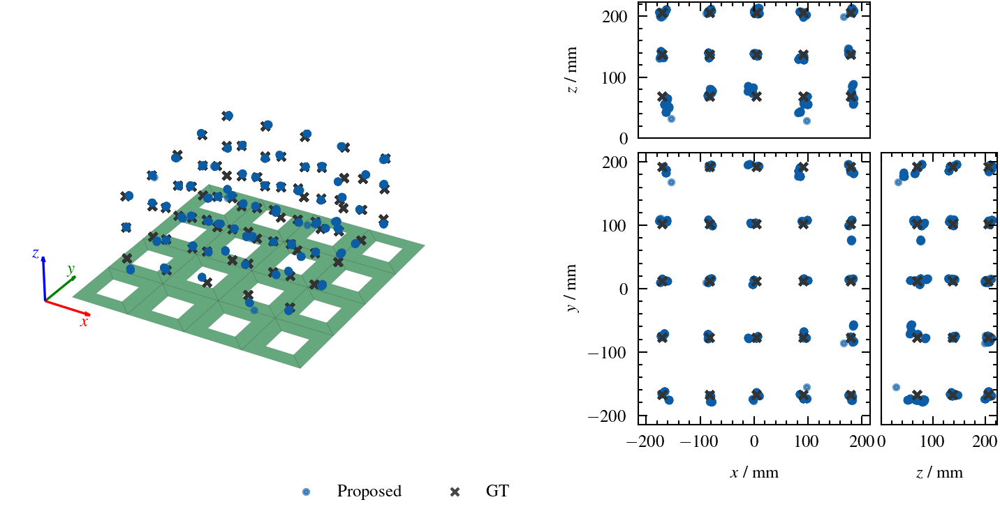

# Data-Driven Localization of Magneto-Mechanical Resonators from Time Signals

This repository contains the implementation of a deep learning approach for rapidly estimating the position of magneto-mechanical resonators (MMRs) from time-domain signals. MMRs are miniaturized sensor platforms enabling effective tracking and sensing for biomedical applications, but extracting sensor parameters from raw signals is computationally challenging. We demonstrate that a convolutional-transformer architecture trained on simulated data with recorded noise can generalize to experimental measurements, achieving a median localization error of 7 mm with inference in 13 ms per batch, enabling real-time applications.



## Installation

The code has been developed and tested on AlmaLinux 9.6.

Before proceeding, ensure you have the following software installed:
- [Git](https://git-scm.com/install)
- [Conda](https://github.com/conda-forge/miniforge)

Once the prerequisites are met, you can set up the environment and install the necessary dependencies by running the following commands in your terminal:
```bash
git clone https://github.com/IBIResearch/mmr-learned-localization-from-signals.git
conda env create --file env/python/environment.yml
conda activate mmr-learned-localization-from-signals
pip install -e env/python/
```

## Training

## Evaluation

To infer the provided model, run:
```bash
python src/evaluation/infer.py
python src/evaluation/analysis.py
```
You 